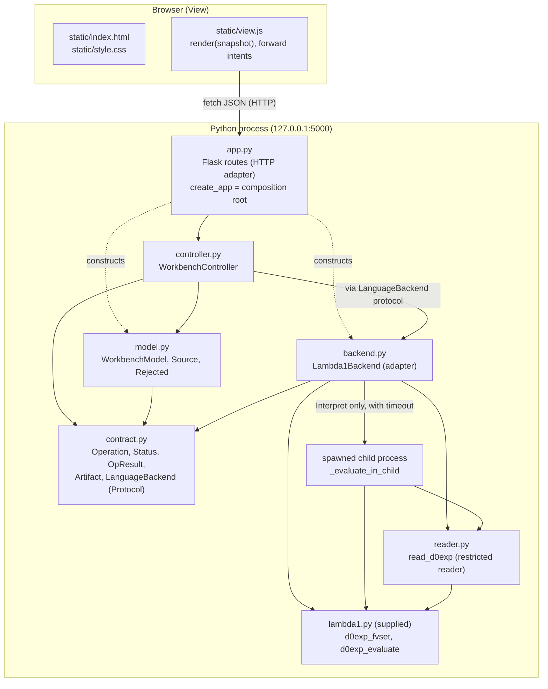

# Architecture: LAMBDA Workbench

A local, single-user web front end for LAMBDA (`lambda1.py`), built with the
Model–View–Controller pattern. The browser page is the **view**. A Python
**model** owns all application state and the rules for it. A Python
**controller** turns user intents into model updates and backend calls. A
**backend adapter** hides how the language tools are invoked.

## 1. Component diagram

Arrows point from a module to the modules it imports or calls.



These dependency rules are enforced by tests in `tests/test_app.py`:

* `model.py` imports only `contract.py` (plus stdlib `dataclasses`). It never
  touches Flask, HTML, `lambda1`, or the backend.
* `controller.py` does not import Flask, `lambda1`, `reader`, or `backend`. It
  gets a backend object through its constructor and uses it only through the
  `LanguageBackend` protocol.
* `view.js` contains no language logic: no `D0E…` constructors, no free-variable
  code, and no `evaluate`. It never uses `innerHTML`.

## 2. Responsibility table

| Role | File(s) | Classes / functions | Responsibilities |
| --- | --- | --- | --- |
| **Model** | `model.py` | `WorkbenchModel`, `Source`, `validate_text`, `decode_upload`, `Rejected` | Owns the applied source (name, text, revision), the editor draft, results for the current revision, the generated-code artifact, the busy flag, and the last notice. Enforces the rules: no empty or oversized source, strict UTF-8 decoding, a new revision on every accepted change (which clears results and the artifact), no tool actions or source replacement while edits are unapplied, one action at a time, stale results dropped, Execute only with an artifact for the current revision. `snapshot()` exports plain data for the view. |
| **View** | `static/index.html`, `static/view.js`, `static/style.css` | `render`, `renderActions`, `renderResults`, event listeners | Shows the Load source menu, editor, Apply/Discard, the five action buttons in order, the reasons any button is disabled, the busy/ready status, and the results. All text is inserted with `textContent`, so HTML-like text displays literally. Each user action becomes one HTTP request. Button state comes from the snapshot, not from rules in the view. |
| **Controller** | `controller.py` (core); `app.py` (HTTP adapter) | `WorkbenchController.upload / choose_example / manual_input / edit / apply / discard / run`; Flask route functions | Handles source changes and action requests. Checks preconditions through the model (`model.begin`), calls the backend *outside* the state lock, records the result (`model.finish`), and turns backend exceptions into `BACKEND_FAILURE` results. `app.py` only converts HTTP to and from these method calls and binds to loopback. |
| **Backend contract** | `contract.py` | `Operation`, `Status`, `OpResult`, `Artifact`, `LanguageBackend` | The data shared by the model, controller, and any backend. |
| **Backend adapter** | `backend.py`, `reader.py` | `Lambda1Backend`, `free_variables`, `contains_error_value`, `format_value`, `_evaluate_in_child`; `read_d0exp` | Reads source with the restricted reader. Implements Lint (`d0exp_fvset`) and Interpret (`d0exp_evaluate` in a killable child process with a timeout). Returns placeholders for Type-check and Compile, and reports Execute as unavailable when there is no artifact. |

**Who coordinates the backend?** The controller does. The model stays a pure
state machine: it says *whether* an operation may run and stores the result,
but never performs I/O. That keeps the model easy to unit-test (no backend at
all is needed), and it means swapping or mocking the backend only touches the
controller's constructor argument.

## 3. Backend contract

```text
lint(source, revision)        -> OpResult
interpret(source, revision)   -> OpResult
typecheck(source, revision)   -> OpResult  (status NOT_IMPLEMENTED)
compile(source, revision)     -> OpResult  (status NOT_IMPLEMENTED, artifact None)
execute(artifact, revision)   -> OpResult  (UNAVAILABLE without a current artifact)
```

`OpResult(operation, revision, status, summary, output, artifact=None)` ties
each result to the operation and source revision that produced it.

| `Status` | Meaning | Examples |
| --- | --- | --- |
| `OK` | Operation succeeded | Lint found no free variables; Interpret returned `D0Vint(arg1=42)` |
| `INPUT_ERROR` | Source is not a valid constructor expression | syntax error, unknown constructor, `D0Eint("1")`, unknown operator |
| `LANGUAGE_ERROR` | Input is valid but the program is wrong | free variables (Lint); division by zero, type mismatch, `D0V000()` sentinel, too-deep recursion (Interpret) |
| `BACKEND_FAILURE` | The tool itself failed | timeout, child process crashed, unexpected exception in the backend |
| `NOT_IMPLEMENTED` | Placeholder operation | Type-check, Compile |
| `UNAVAILABLE` | Preconditions not met | Execute with no artifact for this revision |

Only `OK` counts as success (`OpResult.ok`). The view gives each status
different text ("Success", "Error (program)", "Failure (backend)", "Not
implemented", ...), so meaning never depends on color alone.

**Artifact contract** (for a future compiler): `Artifact(revision, target,
code)`. `revision` is the source revision it was compiled from. `target` names
the output format (e.g. `"python"`). `code` is the generated program text.

## 4. Trace: Load source → Lint → Interpret

The scenario below uses manual input, starting with an open expression.

1. **Load (Manual input).** The user picks *Manual input* and presses **Load**.
   `view.js` sends `POST /api/source/manual` → `WorkbenchController.manual_input`
   → `model.start_manual()`. The model checks it is not busy and has no
   unapplied edits, then sets an empty draft named "Manual input". The view
   renders the returned snapshot: the editor is blank.
2. **Edit.** On each keystroke `view.js` immediately disables the action
   buttons (local `localEdit` flag), then sends `PUT /api/draft {text}` →
   `controller.edit` → `model.edit`. The model now reports `dirty=True`, and every
   action's `reason` is "Apply or discard your edits first."
3. **Apply.** `POST /api/draft/apply` → `model.apply()` validates the draft
   (non-empty, ≤ 64 KiB). It installs `Source("Manual input", 'D0Evar("x")',
   revision=1)`, clears results and the artifact, and enables Lint and
   Interpret.
4. **Lint.** `POST /api/action/lint` → `controller.run("lint")`:
   1. Under the lock: `model.begin(LINT)` checks the action is enabled, sets
      `busy=LINT`, and returns the source and revision. Meanwhile the view shows
      "Busy: running Lint…" with all controls disabled.
   2. Outside the lock: `backend.lint(text, 1)` → `read_d0exp` builds
      `D0Evar("x")`, then `d0exp_fvset` returns `frozenset({"x"})`.
   3. **Undeclared-variable response:** the set is not empty, so the backend
      returns `OpResult(LINT, 1, LANGUAGE_ERROR, "Undeclared variable(s): x",
      "Free (undeclared) variables:\n  x")`. Nothing is evaluated.
   4. Under the lock: `model.finish(result)` clears `busy` and appends the
      result, since its revision still matches. The view renders "Lint · revision 1 ·
      Error (program): Undeclared variable(s): x".
5. **Fix and re-apply.** The user edits the text to
   `D0Elet("x", D0Eint(41), D0Eop1("+1", D0Evar("x")))` and applies it as
   revision 2. Old results are cleared.
6. **Lint again.** `d0exp_fvset` returns `frozenset()` → `OK`, "No free
   variables found".
7. **Interpret.** `controller.run("interpret")` → `model.begin(INTERPRET)` →
   `backend.interpret(text, 2)`:
   1. Read the source in-process first. An invalid input would return
      `INPUT_ERROR` here.
   2. Spawn a child process running `_evaluate_in_child`. It calls
      `d0exp_evaluate(exp, ENVnil())` and sends `("ok", "D0Vint(arg1=42)")`
      back through a pipe.
   3. The parent waits for the pipe *or* the child's exit, up to 5 s. On
      timeout it kills the child and returns `BACKEND_FAILURE`.
   4. `model.finish` stores `OpResult(INTERPRET, 2, OK, "Evaluated",
      "D0Vint(arg1=42)")`, and the view shows it.

If Interpret had run on revision 1 (`D0Evar("x")`) without Lint, the
evaluator would return the sentinel `D0V000()`. `contains_error_value`
detects it, and the result is a `LANGUAGE_ERROR` rather than a fake success.

## 5. Design decisions and tradeoffs

**D1 — The model lives on the server; the browser holds only a rendering
copy.** Every intent, including each editor change, goes to the controller,
and the view re-renders from the returned snapshot. *Benefit:* every state
rule (dirty edits block actions, a new revision clears results, busy blocks
conflicts, Execute needs an artifact) is in one Python class. It is tested
without a browser or server (`tests/test_model.py`), and the view has no rules
of its own to drift out of sync. *Cost:* draft changes are sent per keystroke,
which is chatty, and the view must handle request ordering. `view.js`
serializes requests through one promise queue and tracks an edit sequence
number so a late response cannot overwrite newer typing. It also disables the
action buttons on the first keystroke, before the server confirms. This
traffic is fine on loopback but would need debouncing over a real network.

**D2 — Interpret runs in a separate, killable process; Lint runs
in-process.** `d0exp_evaluate` is recursive and can loop or recurse without
limit, and Python cannot safely stop a running thread. A `spawn`ed child
process can be terminated after the 5-second timeout. It also gets its own
raised recursion limit and a 64 MB thread stack. *Cost:* about 150 ms of
process start-up per Interpret, and results must be sent back as plain
strings. Lint stays in-process because free-variable analysis is linear in
the input size. The 64 KiB source limit and the reader's 200-level nesting
limit bound it, so a subprocess is not needed.

(A third, smaller decision: input is parsed with `ast.parse` and checked
node by node against a schema. Nothing is ever passed to `eval`. This rules
out code execution by construction, at the price of keeping a small table of
constructor signatures in `reader.py`.)

## 6. Replacing the placeholders

* **Type-check.** Write a function `d0exp_typecheck(exp) -> type | error` and
  make `Lambda1Backend.typecheck` call it. It should return `OK` with the
  inferred type in `output`, or `LANGUAGE_ERROR` with the diagnostic. No
  changes are needed in the model, controller, or view. The button,
  dispatch, and result rendering already exist, and the statuses already
  separate success from errors.
* **Compile.** Make `Lambda1Backend.compile` translate the d0exp to a target
  (e.g. Python source text). On success it returns `OpResult(COMPILE, rev, OK,
  ..., artifact=Artifact(rev, "python", code))`. `WorkbenchModel.finish`
  already stores a successful compile's artifact. It sets the artifact back
  to `None` on any failed or not-implemented compile, and `_install` clears it
  on every new revision.
* **Execute.** Once an artifact exists for the current revision,
  `action_state(EXECUTE)` enables the button. `controller.run("execute")` passes
  `model.artifact` to `backend.execute(artifact, revision)`. Execute never
  recompiles, and it rejects an artifact whose revision does not match. The
  implementation would run `artifact.code` in the same bounded child-process
  runner Interpret uses, then compare or display its output.
  `tests/test_model.py::test_execute_needs_artifact_for_current_revision`
  already exercises this path with a hand-made artifact.

None of these changes touch `view.js`: it renders whatever actions, reasons,
and results the snapshot contains.
